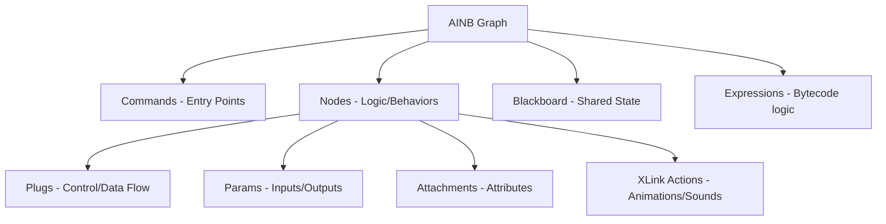

# AINB (AI Node Behavior) File Format Analysis

The **AINB** (AI Node Behavior) format is a proprietary binary graph/behavior tree format used by modern Nintendo games (including *The Legend of Zelda: Tears of the Kingdom*, *Nintendo Switch Sports*, *Splatoon 3*, and *Super Mario Bros. Wonder*) to define AI behaviors, decision-making logic, and sequence graphs.

---

## 1. High-Level Binary Structure

Every AINB file begins with the magic bytes `"AIB "` and is structured as a series of contiguous tables and offsets. Strings in the format are stored globally in a **String Pool** at the end of the file; all string references inside structures are saved as 32-bit offsets relative to the start of the String Pool.

### Binary Header (0x74 Bytes)

| Offset | Type | Description |
| :--- | :--- | :--- |
| `0x00` | `char[4]` | Magic bytes (`"AIB "`) |
| `0x04` | `uint32` | Format Version (Supported: `0x404`, `0x407`, `0x408`) |
| `0x08` | `uint32` | Filename offset (in String Pool) |
| `0x0C` | `uint32` | Entry Point Command Count |
| `0x10` | `uint32` | Node Count |
| `0x14` | `uint32` | Query Node Count |
| `0x18` | `uint32` | Attachment Count |
| `0x1C` | `uint32` | Output Node Count (elements in 200-299 range) |
| `0x20` | `uint32` | Offset to Blackboard Section |
| `0x24` | `uint32` | Offset to String Pool |
| `0x28` | `uint32` | Offset to Enum Resolve Table |
| `0x2C` | `uint32` | Offset to Property Section |
| `0x30` | `uint32` | Offset to Transition Section |
| `0x34` | `uint32` | Offset to IO Parameter Section |
| `0x38` | `uint32` | Offset to Multi-Param Offset Section |
| `0x3C` | `uint32` | Offset to Attachment Section |
| `0x40` | `uint32` | Offset to Attachment Indices |
| `0x44` | `uint32` | Offset to Expression Section (`EXB`) |
| `0x48` | `uint32` | Offset to Replacement Table (`0x407`+) |
| `0x4C` | `uint32` | Offset to Query Section |
| `0x50` | `uint32` | Header Offset Section 0x50 |
| `0x54` | `uint32` | Unused |
| `0x58` | `uint32` | Offset to Unknown Section 0x58 (mainly `0x404`) |
| `0x5C` | `uint32` | Offset to Modules Section |
| `0x60` | `uint32` | Category Name Offset (in String Pool) |
| `0x64` | `uint32` | Category Enum (`AI = 0`, `Logic = 1`, `Sequence = 2`, etc.) |
| `0x68` | `uint32` | Offset to XLink Actions Section |
| `0x6C` | `uint32` | Offset to Section 0x6c (splatoon 3 only) |
| `0x70` | `uint32` | Offset to Blackboard ID Table |

---

## 2. Graph Components

An AINB behavior graph is made up of **Commands**, **Nodes**, **Plugs**, **Attachments**, and a shared **Blackboard**.

### A. Commands (Entry Points)
Commands represent the external interfaces or entry points into the behavior graph.
- Each command defines a `name` (string), a unique `guid`, a `root_node_index` (the initial node to run), and an optional `secondary_root_node_index`.

### B. Nodes
Nodes represent specific behaviors, structural components, or conditional selectors.
- **Node Metadata**: Each node contains a `NodeType`, `index`, `name`, `guid`, `NodeFlag` (`Is Query`, `Is Module`, `Is Root Node`, `Use MultiParam Type 2`), and optional `state_info`.
- **Node Types**:
  - `UserDefined (0)`: Custom runtime behaviors defined in-game.
  - **Selectors**:
    - `Element_S32Selector (1)`
    - `Element_Sequential (2)`
    - `Element_Simultaneous (3)`
    - `Element_F32Selector (4)`
    - `Element_StringSelector (5)`
    - `Element_RandomSelector (6)`
    - `Element_BoolSelector (7)`
    - `Element_Fork (8)`
    - `Element_Join (9)`
    - `Element_Alert (10)`
  - `Element_Expression (20)`: Nodes that execute compiled EXB expressions.
  - **Module Interfaces**: Input and output nodes representing parameters when this graph is nested within another graph (`Element_ModuleIF_Input_*` / `Element_ModuleIF_Output_*`).
  - `Element_ModuleIF_Child (300)`: Links to sub-modules (nesting other AINB files).
  - `Element_StateEnd (400)` & `Element_SplitTiming (500)`.

### C. Plugs (Connections)
Plugs define the flow of control and data between nodes. Plugs are categorized into `PlugType`:
1. **Generic Plugs**: Used for standard inputs (e.g. Bool/Float selectors) and outputs.
2. **Child Plugs**: Define control flow branches. Selectors use specialized versions:
   - `S32SelectorPlug`: Checks a signed integer `condition` or routes to the default branch (`is_default`). Can also reference a blackboard value via `blackboard_index`.
   - `F32SelectorPlug`: Checks range bounds `condition_min` and `condition_max` (or their blackboard index equivalents) to match.
   - `StringSelectorPlug`: Checks string equality with `condition` or matches the default fallback (`"その他"` / "Others").
   - `RandomSelectorPlug`: Uses a float `weight` (or blackboard index) for probabilistic path selection.
   - `BSASelectorUpdaterPlug`: Used in BSA Selector systems (`SelectorBSABrainVerbUpdater`, `SelectorBSAFormChangeUpdater`) to bind a blackboard enum to state changes.
3. **Transition Plugs**: Handle state transitions. Points to a target state node and houses a `Transition` entry (defines transition type, `update_post_calc` flag, and optional entry point `command_name`).
4. **String/Int Selector Input Plugs**: Selector input values (with potential defaults in `0x407`+).

### D. Attachments & Properties
- **Attachments**: Custom components attached to nodes. They add modular behaviors/attributes to nodes. Each attachment has a `name`, a `debug` flag, and its own local `PropertySet`.
- **Properties**: Configuration options on nodes or attachments. Each property has a name, value type, default value, and `ParamFlag` (defining if the property inherits from blackboard/expressions).

### E. Input & Output Parameters (`ParamSet`)
Nodes define `Inputs` and `Outputs` grouped by their data types (Int, Bool, Float, String, Vector3F, Pointer).
- **Output Parameters**: Carry computed values out. Marked with `is_output` if wired to another node.
- **Input Parameters**: Can derive their values from multiple sources:
  - **Immediate/Constant**: Specified using a hardcoded `default_value` and flag `Uses Default`.
  - **Node Output Link**: Linkage to another node's output parameter via a `ParamSource` (`src_node_index` and `src_output_index`).
  - **Blackboard Connection**: Binds the parameter to a shared blackboard variable by index.
  - **Expression**: Evaluated from a compiled VM expression.
  - **Multi-Source**: An array of multiple `ParamSource` items, allowing a parameter to pull from multiple nodes depending on active execution paths.
  - **Vector Component mapping**: Individually maps X, Y, or Z components of a Vec3f parameter to separate f32 inputs.

---

## 3. Blackboard System

The Blackboard is a central repository of key-value pairs shared across the graph and nested modules.
- **Parameters**: Blackboard parameters have a `name`, `type` (`BBParamType`), description `notes`, flags (`flags` indicating whether they are inheritable between modules), and a `default_value`.
- **Supported Data Types**:
  - `String` (0)
  - `S32` (1)
  - `U32` (2) *[Supported in Version `0x408`+]*
  - `F32` (3)
  - `Bool` (4)
  - `Vec3f` (5)
  - `VoidPtr` (6) *[Used for referencing active game entity pointer handlers]*
- **File References**: Parameters can reference another blackboard schema (`file_ref`), allowing modular blackboard definitions to overlay and import shared settings dynamically.

---

## 4. Expression System (EXB format)

For complex, mathematical, or procedural conditionals, AINB embeds a compiled bytecode block under the **EXB** (Expression Binary) format (magic `"EXB "`, versions 1, 2, or 3). 

Instead of drawing hundreds of nodes for math operations (e.g. `(Player.hp < 20) && Player.is_climbing`), AINB compiles these expressions into standard stackless/register-oriented VM instructions.

### EXB Structure
1. **Header**: Outlines mem usage, signature offsets, param table offsets, and the string pool.
2. **Expressions**: Each expression is split into:
   - `.setup` command block (initial operations, ran once).
   - `.main` command block (evaluated each frame or access).
   - Datatypes (`input_datatype`, `output_datatype`).
3. **Instructions**: An array of 8-byte compiled instructions.
4. **Signature Table**: Function names called by the VM.
5. **Param Table**: Hardcoded literals (constants, strings, vectors) that exceed immediate sizes.

### VM Instructions (`InstType`)
The expression system contains 29 core operations:

- **Flow Control**: `END` (Terminator), `CFN` (Call Function - maps to signature table), `JZE` (Jump if False), `JMP` (Direct Jump).
- **Memory/Store**: `STR` (Copies operand value to destination offset).
- **Arithmetic**: `ADD` (+), `SUB` (-), `MUL` (*), `DIV` (/), `MOD` (%), `NEG` (Negate), `INC` (++), `DEC` (--).
- **Vector Operations**: `VMS` (Vec3f * Scalar), `VDS` (Vec3f / Scalar).
- **Relational / Logical**: `LST` (<), `LTE` (<=), `GRT` (>), `GTE` (>=), `EQL` (==), `NEQ` (!=), `NOT` (!), `LAN` (&&), `LOR` (\|\|).
- **Bitwise**: `LSH` (<<), `RSH` (>>), `AND` (&), `XOR` (^), `ORR` (\|).

### VM Operands (`InstOpType`)
Operands specify where a value is loaded from or saved to:
- `Immediate` / `ImmediateString`: Small values encoded directly in the instruction.
- `ParamTable` / `ParamTableString`: Large constants stored in the EXB's Param Table.
- `GlobalMemory` (`GMem`): Context-wide variables shared across all expressions in the AI context.
- `LocalMemory32` (`LMem32`) / `LocalMemory64` (`LMem64`): Variable registers inside the local execution context (used for storing intermediate variables).
- `ExpressionInput` (`In`) / `ExpressionOutput` (`Out`): Inbound and outbound registers.
- `Input` (`UserIn`) / `Output` (`UserOut`): Map to parent node parameter offsets in the AINB graph.

---

## 5. Replacement System (Version `0x407`+)

Introduced in version `0x407`, the **Replacement Table** allows AINB behavior graphs to support dynamic, runtime hot-swapping or pruning of branches:
- **`RemoveChild` (0)**: Removes a linked control plug at runtime.
- **`ReplaceChild` (1)**: Swaps a child node pointer with another target node index.
- **`RemoveAttachment` (2)**: Dynamically detaches custom attachments.

This enables the engine to alter enemy behaviors and logic structures under different game difficulties, visual states, or environmental conditions without needing entirely separate AINB assets.
