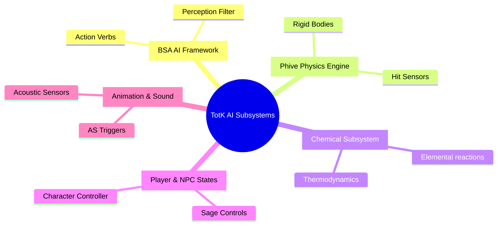

# TotK AI Node Definitions & Framework Analysis

This document provides a structural breakdown and classification of the **7,130 AI Nodes** defined in *The Legend of Zelda: Tears of the Kingdom* (TotK) based on [aidef.txt](file:///c:/Users/dmone/Desktop/ComSci/Modding/totk-vscode/research/aidef.txt).

---

## 1. Node Definition Schema

Every node in `aidef.txt` is structured as a YAML-like mapping using exactly two second-level metadata fields under the Node Name:
*   `Inputs`: Typed parameter sets with optional hardcoded `{ default: value }` mappings.
*   `Tags`: Semantic categorization identifiers indicating how the node fits into the runtime engine and behavior graphs.

### Schema Example:
```yaml
CycleCheckBoolSelector: 
  Inputs: 
    Bool: 
      Bool: { default: false }
      IsUseTimer2: { default: false }
    Int: 
      Timer2Max: { default: 0 }
      Timer2Min: { default: 0 }
      TimerMax: { default: 35 }
      TimerMin: { default: 30 }
  Tags: [Selector]
```

---

## 2. Core Functional Node Groups

The 7,130 nodes can be organized into distinct functional categories based on their tags:

### A. Execution & Control Flow
*   **`Selector`** (326 nodes): Core branching nodes that redirect execution flow based on conditions (e.g. `CycleCheckBoolSelector`, `ExecuteBSAActionCurrentVerbStatusSelector`). These translate directly to AINB's selector nodes.
*   **`OneShot`** (1,380 nodes): Immediate nodes that perform a single action once and finish executing instantly (e.g. setting an environment flag, triggering a sound, spawning particles).
*   **`Execute`** (1,609 nodes): Continuous/stateful actions. These nodes keep running over multiple frames (e.g., moving to a point, playing an animation loop) until interrupted or completed.
*   **`Flowchart`** (221 nodes): Nodes designated for high-level scripting flowcharts rather than low-level behavior trees.

### B. Read-Only Calculations & Queries
*   **`Query`** (2,312 nodes): Calculation nodes that check game states, perform math, or query actor attributes (e.g. `CalcCaveMasterNum`, `CalcCaveWellNum`). They do not perform action behaviors themselves, but compute values to pass into other nodes.
*   **`Condition`** (44 nodes): Evaluates specific game-world conditionals to drive selector logic.

### C. Scripting & Event Systems
*   **`EventNode`** (1,499 nodes) / **`EventTrigger`** (553 nodes) / **`EventQuery`** (347 nodes): Nodes handling cutscenes, cameras, dialog scripts, and event timelines (e.g. `EventAbyssCamera`, `EventAIScheduleMoveToAnchor`).
*   **`AIScheduler`** (177 nodes): Directs daily/hourly routines and path networks for town NPCs and travelers.

---

## 3. Subsystem-Specific Groups



### A. The BSA (Brain-Senses-Action) Framework (248 nodes)
BSA is Nintendo's core AI pattern for enemies and friendly NPCs in TotK:
*   Nodes with the `BSA` tag govern verb selection, sensory checks, state machines, and combat targeting.
*   Uses input types like `game::bsa::ActionVerb` to command the creature's active action states (e.g. Idle, Combat, Retreat, SightDown).

### B. Physics & Collisions (456 nodes)
Tagged with `Physics` or mapping to Nintendo's custom *Phive* physics system:
*   Deals with collision detection, layer sensors, hit masks, and rigid body actions.
*   Frequently uses inputs like `phive::RigidBodyEntity`, `phive::RigidBody`, and `phive::game::LayerSensor`.

### C. The Chemical Subsystem (59 nodes)
Governs TotK's thermodynamic and elemental interactions:
*   Deals with fire, water, wind, ice, electric charges, and reaction states.
*   Calculates elemental values, ignition states, and chemical responses on entities.

---

## 4. Parameter Data Types Breakdown

While basic types represent 95% of node parameters, TotK defines custom C++ engine classes as inputs for complex subsystems:

| Category | Input Data Type | Subsystem / Description |
| :--- | :--- | :--- |
| **Primitives** | `Bool`, `Float`, `Int`, `String`, `Vector3` | Standard inputs mapped directly inside AINB files. |
| **Engine Math** | `const sead::Matrix33f`, `const sead::Matrix34f` | High-precision transformation matrices from Nintendo's standard library (SEAD). |
| **Physics** | `phive::RigidBodyEntity`, `phive::RigidBody`, `phive::game::LayerSensor` | Phive physics elements handling entities and sensory fields. |
| **AI Targeting** | `game::target::TargetSlots`, `game::actor::ActorLinkBase` | Combat target arrays and references linking actors together. |
| **Senses** | `game::perception::SenseTypes`, `game::perception::PerceiveDataList` | Sense configurations (e.g., visual cone range, noise levels). |
| **BSA** | `game::bsa::ActionVerb`, `bb::OverwriteParam` | Verbs and blackboard parameters forcing AI state switches. |
| **Game Specific**| `game::npc::SageType`, `game::animal::GearType`, `game::memory::MemoryType` | Custom structures for Sages, mounts, and save-data. |
