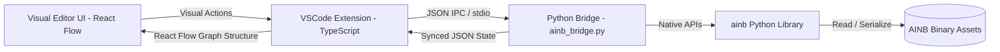

# Specification: AINB VSCode Behavior Graph Node Editor

This document outlines the complete architectural design, data models, and feature requirements for building a full-fledged **AINB Behavior Graph Node Editor** integrated directly inside VSCode.

---

## 1. System Architecture & Data Flow

The editor utilizes a three-tier architecture to bridge robust Python-based binary processing with a highly interactive, modern React Flow visual canvas inside VSCode.



### A. The Three-Tier Stack
1.  **Frontend View (React + React Flow)**: Runs inside a VSCode Webview panel. Responsible for rendering the nodes, drawing edges, rendering panels (Blackboard, properties, commands), and capturing user gestures.
2.  **Extension Host (TypeScript)**: The coordinator. Manages workspace files, multi-file editors, panel state, and pipes actions from React to the Python bridge.
3.  **Backend Daemon (`ainb_bridge.py`)**: A lightweight Python process that wraps the core Python `ainb` library. It handles precise graph re-indexing, expression compilation, enum database lookup, and binary reading/writing.

---

## 2. Graph Model & Separation of Concerns

To prevent erratic behavior trees and ensure clean graph execution, the editor must strictly enforce the separation of concerns between **Flow Ports** and **Data Ports**.

```
+-------------------------------------------------+
|                   NODE NAME                     |
+-------------------+-----------------------------+
| FLOW PORTS        | DATA PORTS                  |
|                   |                             |
| ( ) In            | [i] Input_1  <-- [Constant] |
|                   | [f] Input_2  <--------- [o] |
| ( ) Out: Match    |                             |
| ( ) Out: Default  | [o] Output_1                |
+-------------------+-----------------------------+
```

### A. Flow Ports (Execution Canvas)
*   **Inbound Flow Handle**: Top or left of the node. Represents execution entering the node.
*   **Outbound Flow Handles**: Mapped from AINB `ChildPlugs` and `TransitionPlugs`. Mapped to specific selector conditions (e.g., specific integer values or `"その他"` defaults).
*   **Validation Rules**: 
    *   Flow outputs can *only* connect to Flow inputs.
    *   An outbound flow port represents a singular control pathway; it can only connect to one target node.

### B. Data Ports (Parameters & Properties)
*   **Inbound Data Handles**: Mapped from `InputParam` structures (Int, Bool, Float, String, Vector3F, Pointer).
*   **Outbound Data Handles**: Mapped from `OutputParam` structures.
*   **Validation Rules**:
    *   Data outputs can *only* connect to Data inputs.
    *   Type safety: The editor must prevent connecting mismatched types (e.g. connecting a Vector3F output to an Int input) unless the target handles dynamic casting or component extraction (X, Y, Z vector mapping).
    *   An input data port can only have *one* active source binding (except for nodes specifically flagged with `Use MultiParam Type 2` which support multi-source arrays).

---

## 3. Core Editor Features & Operations Lifecycle

### A. Workspace & Multi-File Command View
*   **Split Screen View**: Support displaying multiple behavior files side by side, allowing copy-paste of nodes and branches between files.
*   **Submodule Navigation**: When a node is a module reference (`Element_ModuleIF_Child`), double-clicking it should automatically open that sub-module's AINB file in a nested tab.

### B. Command (Entry Point) Operations
*   **Command Registration Panel**: A sidebar listing all defined commands (e.g. `Main`, `SightDown`).
*   **Target Binding**: UI to set or re-route the `root_node_index` and `secondary_root_node_index` by dragging a wire from the command slot directly to a node on the canvas.
*   **Command CRUD**: Support adding new commands, renaming commands (with auto-generated GUIDs), and deleting entry points.

### C. Node Lifecycle & Canvas Actions
*   **Creation (Searchable Node Palette)**: A context menu or sidebar showing all 7,130 TotK nodes filtered by tags (Query, OneShot, BSA, Selector, Physics). Includes descriptions and input templates sourced from `aidef.txt`.
*   **Deletion & Shifting Cascade**: When a node is deleted, the extension sends a `remove_node` event to the Python bridge, which executes `_shift_indices` to decrement all succeeding node indices, cleanly rewires remaining edges, and updates all command indices.
*   **Branch Collapse/Expansion**: Allow grouping a branch of nodes into a collapsible sub-graph container to manage massive behavior trees.

### D. Parameter & Property Editing Panel
When a node is selected, a dedicated inspector panel displays:
1.  **Source Switcher**: A dropdown for each input parameter to select its driver:
    *   *Default Constant*: Renders an inline editor (toggle for Bool, number field for Float/Int, text box for String, triple fields for Vector3F).
    *   *Blackboard Index*: Displays a dropdown of matching Blackboard parameters.
    *   *Node Output Connection*: Disables manual inputs and lights up the canvas port for visual wiring.
    *   *Expression*: Opens a compiled EXB bytecode editor panel.
2.  **Property Inspector**: Dedicated configuration fields for local property parameters.

### E. Blackboard Management
*   **Global Schema Editor**: A tab to view and manage all blackboard fields (String, S32, U32, F32, Bool, Vec3f, VoidPtr).
*   **Variable CRUD**:
    *   Add variables with default values, notes, and file schema references.
    *   Delete variables with cascading warning alerts detailing which nodes are actively bound to this index.
*   **Re-indexing sync**: Auto-shifts parameter indices in referencing node lists when a blackboard variable is deleted or moved in the schema list.

---

## 4. Python-TypeScript Bridge Communication Protocol

The TypeScript host communicates asynchronously with `ainb_bridge.py` via `stdio` using structured JSON frames.

### A. Graph Loading Request / Response
*   **TS sends**: Absolute path to file and active game mode (TotK, Splatoon 3, etc.).
*   **Bridge returns**: A flattened, parsed JSON representation of AINB including nodes, commands, blackboard arrays, coordinates (derived from editor metadata), and a list of structural validation warnings.

### B. Canvas Modifications (Incremental Updates)
*   **Add Node Event**: TS requests a node creation. Bridge creates the instance, assigns the next index, and returns the updated index list.
*   **Connect Ports Event**: Defines source/target node indices, port types, and param slots. Bridge updates parameter bindings and transitions natively.
*   **Delete Node Event**: Bridge populates deletions, shifts succeeding node index lists down, nullifies references, and returns a clean delta state to synchronize the React Flow UI.

### C. Serialization & Compile Request
*   **Save Event**: TS sends the canvas state. Bridge validates structures, maps coordinates, compiles EXB expression bytecode, builds binary headers, and writes the `.ainb` file.

---

## 5. UI/UX Design System & Polish

A premium, interactive theme aligned with VSCode’s design language (dark mode optimized, high-contrast, harmonious HSL palettes).

### A. Visual Aesthetics & Polish
*   **Color-Coded Handles**:
    *   *Execution Flow*: Bright Cyan / Neon Blue.
    *   *Data Types*: Unique palette for parameter data handles (e.g. Green for Bool, Yellow for Int/Float, Violet for String, Orange for Vector3F, Red for Pointers).
*   **Port Hover Indicators**: Hovering over an output handle highlights all eligible input handles across the canvas while dimming ineligible ports to guide valid connections.
*   **Visual Highlights**: Green borders on active root nodes; distinct dashed/colored borders for `Query` vs. `OneShot` nodes; glowing red highlight for disconnected pins.
*   **Performance Optimization**: React Flow node virtualization to maintain smooth 60fps canvas operations even when rendering graphs exceeding 500+ nodes.
